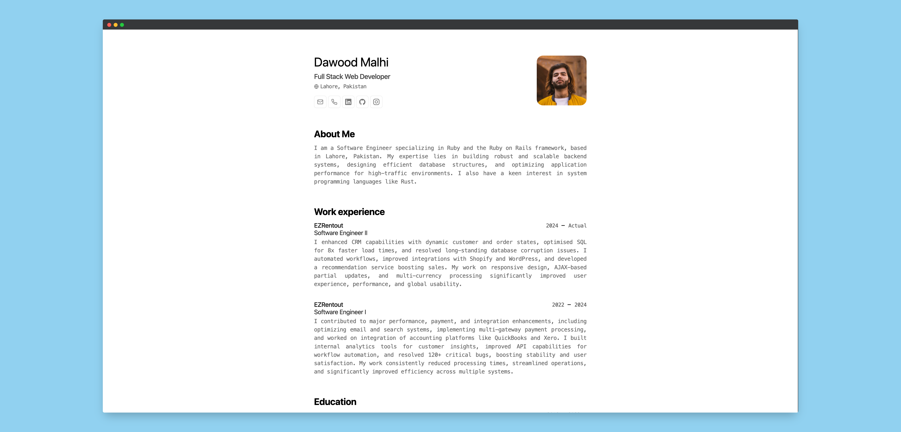

<div align="center">
     
    <h2><em>Résumé</em> Minimalist Layout for Web and PDF</h2>
    <p>JSON Resume Schema from <a href="https://jsonresume.org/schema/">jsonresume.org</a></p>
    <p>Based on the design by <a href="https://github.com/BartoszJarocki/cv">Bartosz Jarocki</a> and template by <a href="https://github.com/midudev/minimalist-portfolio-json">Miguel Ángel Durán</a></p>
</div>

</img>

## 🛠️ Stack

- [**Astro**](https://astro.build/) - The modern web framework.
- [**TypeScript**](https://www.typescriptlang.org/) - JavaScript with type syntax.
- [**Ninja Keys**](https://github.com/ssleptsov/ninja-keys) - Dropdown menu with keyboard shortcuts built in pure JavaScript.

## 🚀 Getting Started

### 1. Use this [repo](https://github.com/dawoodmalhi/minimalist-portfolio-json) as a _template_ for an Astro project

- I use [pnpm](https://pnpm.io/installation) as a dependency manager and bundler.

```bash
# Enable pnpm on macOS, WSL, & Linux:
corepack enable
corepack prepare pnpm@latest --activate

# Initialize the project
pnpm create astro@latest -- --template midudev/minimalist-portfolio-json
```

### 2. Add your content:

Edit the file `cv.json` to create your own printable Portfolio/CV.

### 3. Launch the development server:

```bash
# Enjoy the result
pnpm dev
```

1. open [**http://localhost:4321**](http://localhost:4321/) in your browser to see the result  🚀

## 🧞 Commands

|     | Command         | Acción                                                                       |
| :-- | :-------------- | :--------------------------------------------------------------------------- |
| ⚙️  | `dev` o `start` | Launch a local development server on `localhost:4321`.                       |
| ⚙️  | `build`         | Checks for possible errors and does production packaging in `./dist/`.       |
| ⚙️  | `preview`       | Local Preview `localhost:4321`                                               |

## 🔑 License

This project is licensed under the MIT License - see the [MIT](LICENSE.txt) file for details.
